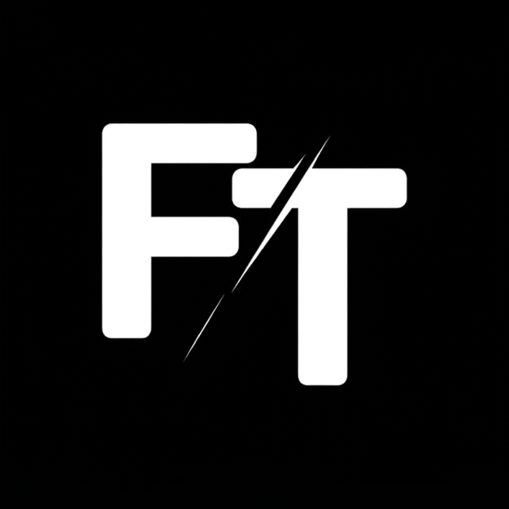
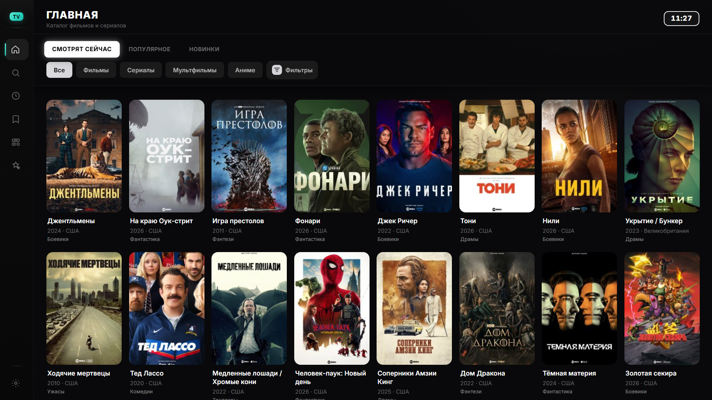
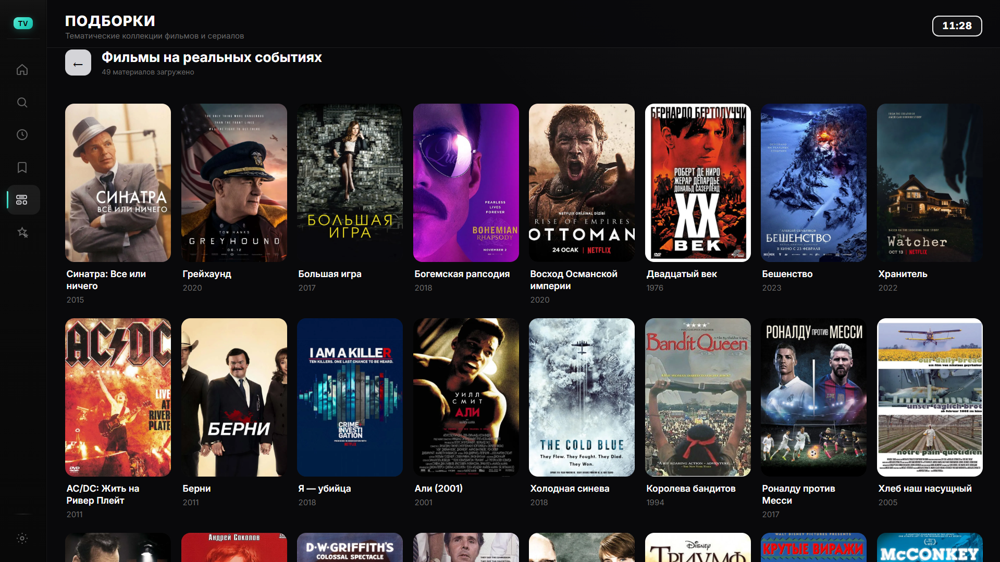
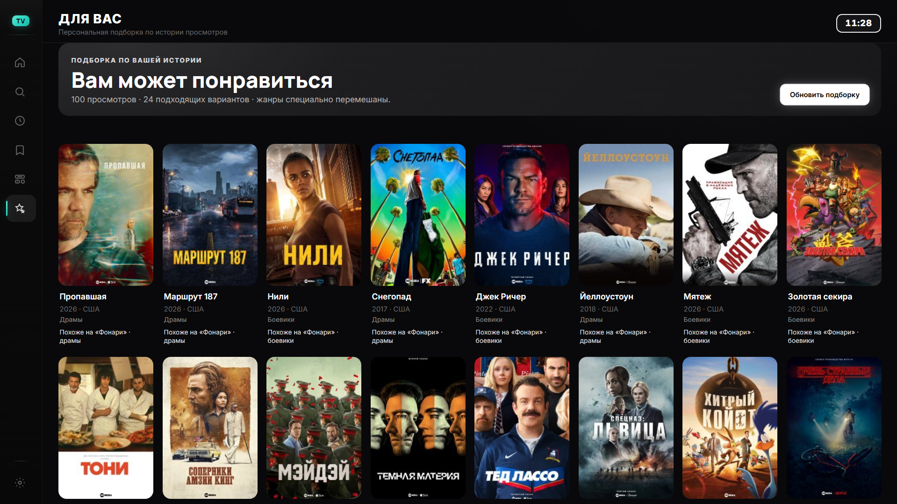
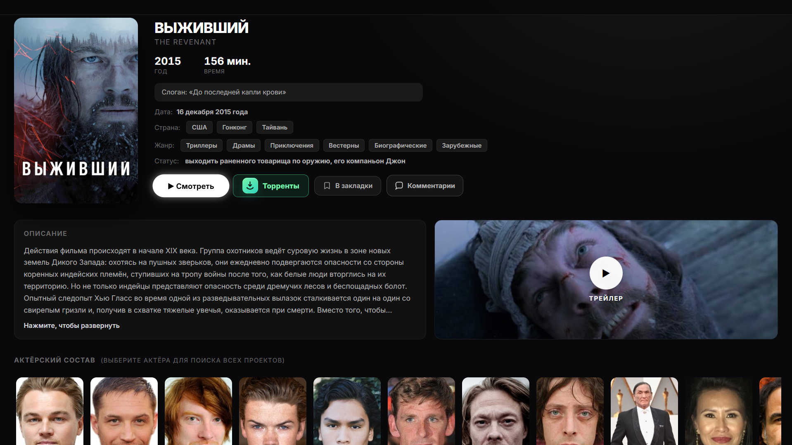

<h1>
  
  Фишка TV
</h1>

### Удобный медиа-агрегатор для Windows

Фишка TV объединяет каталог, поиск, карточки фильмов и сериалов, подключаемые внешние источники и удобный плеер в одном интерфейсе. Приложение не хранит видео и не предоставляет доступ к контенту от своего имени.

## Возможности

- каталог фильмов, сериалов, мультфильмов и аниме;
- поиск, подборки, история и закладки;
- продолжение просмотра с сохранённой позиции;
- выбор озвучки, качества, сезона и серии;
- собственный полноэкранный плеер с субтитрами;
- просмотр трейлеров внутри приложения;
- подключение внешних источников, которые пользователь настраивает самостоятельно;
- поддержка 4K, HDR, Dolby Vision и многоканального звука при наличии совместимого видео и оборудования;
- работа с торрент-раздачами через встроенный или внешний TorrServer после самостоятельной настройки поискового API;
- управление мышью, клавиатурой, пультом и геймпадом;
- интерфейс, рассчитанный как на монитор, так и на телевизор.

## Скриншоты

<table>
  <tr>
    <td width="50%" align="center">
      
    </td>
    <td width="50%" align="center">
      
    </td>
  </tr>
  <tr>
    <td width="50%" align="center">
      
    </td>
    <td width="50%" align="center">
      
    </td>
  </tr>
</table>

## Управление в плеере

| Клавиша | Действие |
|:---:|---|
| `Space` | Пауза / продолжить |
| `←` `→` | Перемотка назад / вперёд |
| `Enter` | Выбрать активную кнопку |
| `F` | Полноэкранный режим |
| `Esc` | Назад / закрыть плеер |

## Системные требования

- Windows 10 или Windows 11, 64-bit;
- подключение к интернету;
- для 4K, HDR и Dolby Vision требуется совместимое оборудование и видеодрайвер.

## Конфиденциальность

Установщик распространяется без аккаунтов, истории просмотров, закладок, cookies и других пользовательских данных. Личные настройки создаются только после первого запуска и хранятся локально на устройстве пользователя.

## Использование внешних источников

- каталог, поиск, карточки и трейлеры доступны без входа в аккаунт;
- воспроизведение через HDRezka возможно только после входа пользователя в собственный аккаунт;
- адрес API поиска торрент-раздач не встроен в приложение и указывается пользователем самостоятельно;
- Фишка TV не размещает видео, торрент-файлы или magnet-ссылки и не продаёт права доступа к контенту;
- приложение не определяет правовой статус каждого материала или внешнего сервиса.

Используйте только собственные аккаунты, разрешённые источники и материалы, на просмотр которых у вас есть право. Пользователь самостоятельно выбирает внешние сервисы и обязан соблюдать их условия, авторские права и законодательство своей страны.

## Обратная связь
Если вы обнаружили ошибку, переходите в наш [телеграм-канал FishkaTVapp](https://t.me/FishkaTVapp) в раздел **Баг-репорты** и по возможности прикрепите описание проблемы и скриншот.

> **Важно:** это описание не является юридической консультацией и не гарантирует законность конкретного источника. Доступность материалов, переводов и качества полностью зависит от сторонних сервисов.

**Фишка TV — любимое кино дома.**

