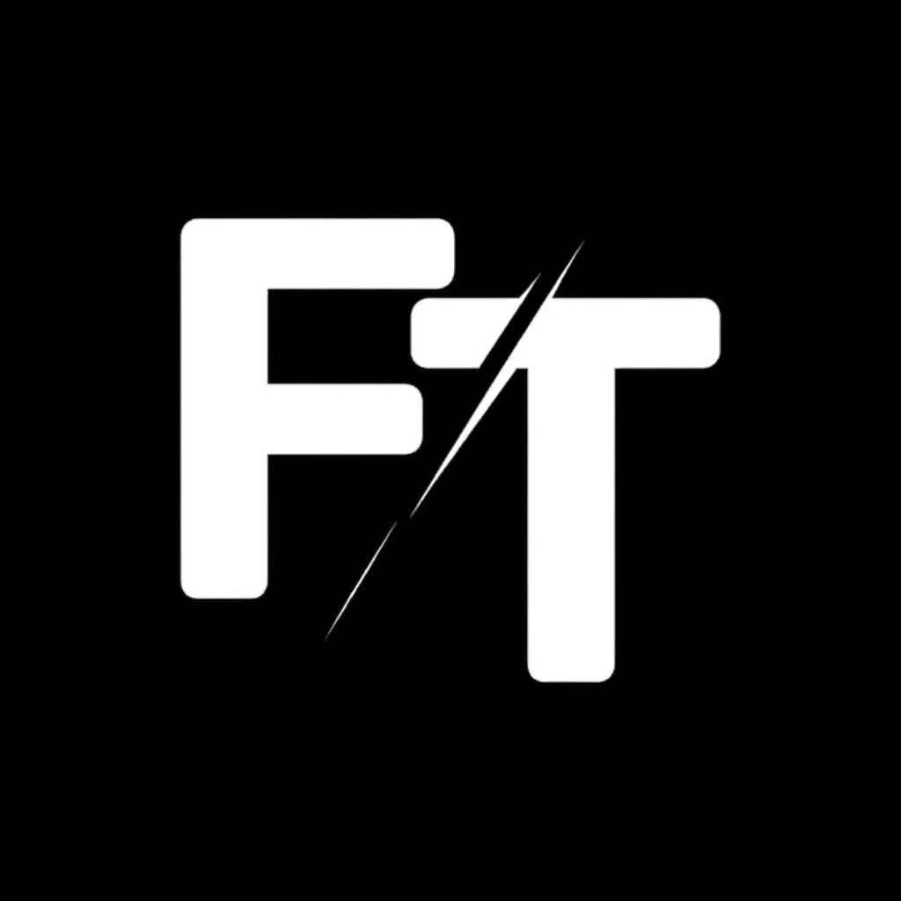
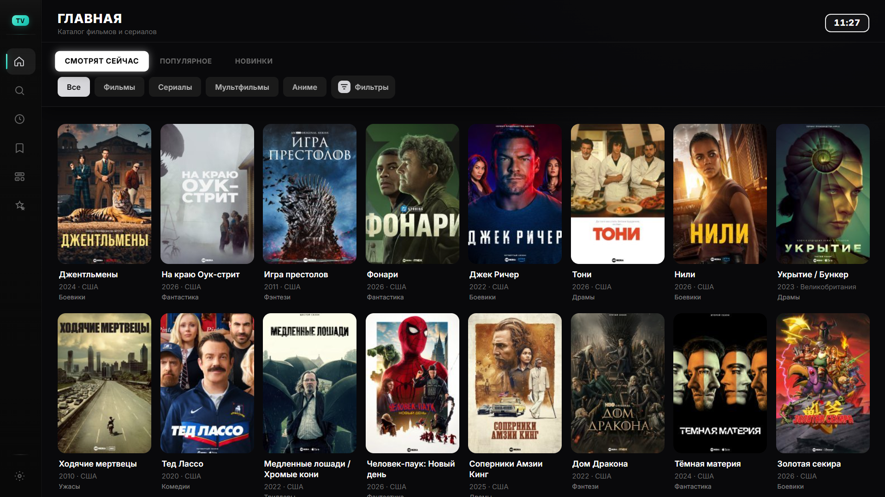
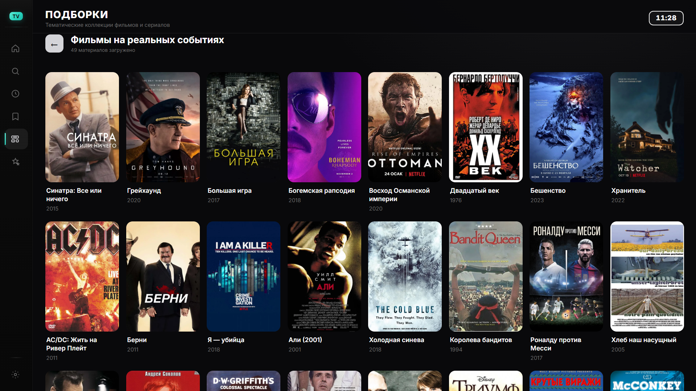
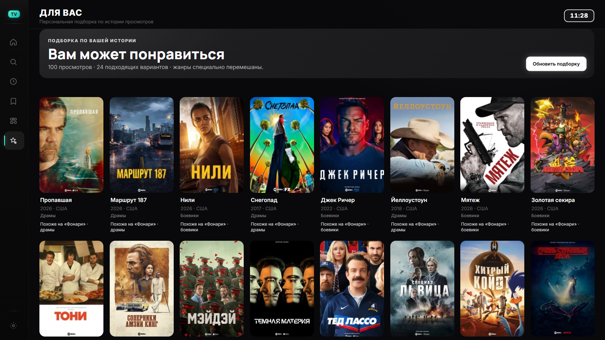
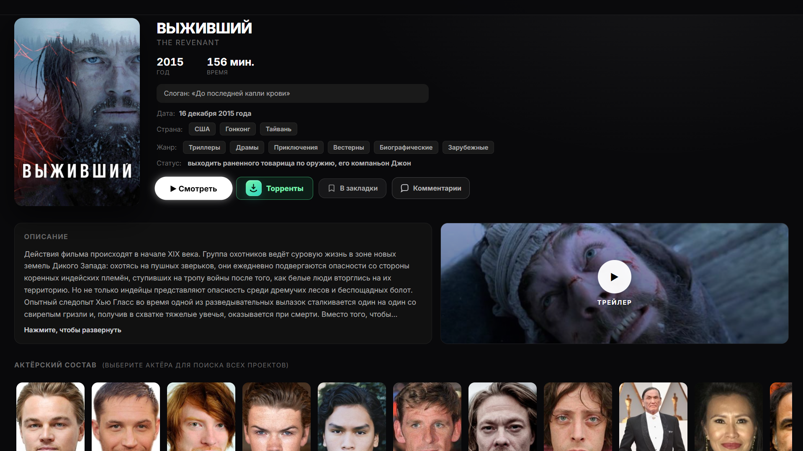

<h1>
  
  Fishka TV
</h1>

### Удобный медиа-агрегатор для Windows и Android TV

Fishka TV объединяет каталог, поиск, карточки фильмов и сериалов, подключаемые внешние источники и удобный плеер в одном интерфейсе. Приложение не является видеохостингом и не продаёт доступ к контенту.

[Все версии и описание релизов](https://github.com/Rtreterasd/FishkaTVapp/releases)

## Скриншоты

<table>
  <tr>
    <td width="50%" align="center">
      
    </td>
    <td width="50%" align="center">
      
    </td>
  </tr>
  <tr>
    <td width="50%" align="center">
      
    </td>
    <td width="50%" align="center">
      
    </td>
  </tr>
</table>

## Возможности

- каталог фильмов, сериалов, мультфильмов и аниме;
- поиск, подборки, история и закладки;
- продолжение просмотра с сохранённой позиции;
- синхронизация истории и прогресса через аккаунт Trakt по выбору пользователя;
- выбор озвучки, качества, сезона и серии;
- полноэкранный плеер с субтитрами;
- просмотр трейлеров внутри приложения;
- подключение внешних источников, которые пользователь настраивает самостоятельно;
- поддержка 4K, HDR, Dolby Vision и многоканального звука при наличии совместимого видео и оборудования;
- работа с торрент-раздачами через встроенный или внешний TorrServer после самостоятельной настройки поискового API;
- управление мышью, клавиатурой, пультом и геймпадом;
- адаптивный интерфейс для монитора, телефона и телевизора.

## Управление

| Клавиша или кнопка | Действие |
|:---:|---|
| `Space` / `OK` | Пауза, продолжить или выбрать активную кнопку |
| `←` `→` | Навигация или перемотка назад/вперёд |
| `↑` `↓` | Навигация и вызов панели плеера |
| `Enter` | Выбрать активную кнопку |
| `F` | Полноэкранный режим в Windows |
| `Esc` / `Back` | Назад или закрыть плеер |

## Системные требования

### Windows

- Windows 10 или Windows 11, 64-bit;
- подключение к интернету;
- для 4K, HDR и Dolby Vision требуется совместимое оборудование и актуальный видеодрайвер.

### Android TV

- Android 7.0 или новее;
- процессор ARMv7 или ARM64;
- пульт с D-pad либо совместимый геймпад;
- для 4K, HDR, Dolby Vision и многоканального звука требуются совместимые телевизор, устройство и декодеры.

## Конфиденциальность и аккаунты

- установщик и APK не содержат аккаунтов, cookies, токенов, истории или других данных пользователей;
- настройки и данные авторизации появляются только после действий пользователя на его устройстве;
- подключение HDRezka используется для каталога, истории и закладок. Для синхронизации прогресса плеера используется отдельное подключение Trakt;
- при включении внешней интеграции приложение передаёт соответствующему сервису только данные, необходимые для выбранной функции. Их дальнейшая обработка регулируется правилами этого сервиса;
- отключение аккаунта или очистка данных приложения удаляет локальные данные Fishka TV, но не удаляет сведения, которые уже хранятся в аккаунте внешнего сервиса;
- не передавайте другим людям свои пароли, cookies, токены и резервные копии данных приложения.

## Внешние источники и контент

- Fishka TV является независимым клиентским приложением и медиа-агрегатором;
- приложение не размещает и не загружает видео, торрент-файлы или magnet-ссылки на собственные серверы;
- адрес поискового API и другие пользовательские источники не включаются в официальную сборку и добавляются пользователем самостоятельно;
- результаты поиска, метаданные и ссылки могут поступать от независимых сторонних сервисов по запросу пользователя;
- разработчик не управляет сторонними сайтами, не гарантирует их доступность, безопасность, точность данных или правовой статус размещённых ими материалов;
- пользователь обязан использовать собственные аккаунты, разрешённые источники и только тот контент, к которому у него есть законный доступ, а также соблюдать правила внешних сервисов и законодательство своей страны.

Fishka TV не связан с HDRezka, TorrServer, Trakt, TMDB и другими упомянутыми сторонними сервисами и не заявляет об их поддержке или одобрении. Все названия, логотипы и товарные знаки принадлежат их владельцам.

## Атрибуция сторонних сервисов

Данные о фильмах, сериалах и изображения могут предоставляться с использованием [TMDB API](https://www.themoviedb.org/). Обозначение TMDB не означает партнёрство с Fishka TV.

> This product uses the TMDB API but is not endorsed or certified by TMDB.

Синхронизация истории и прогресса выполняется через [Trakt API](https://trakt.tv/) только после добровольной авторизации пользователя. Trakt является независимым сервисом и не спонсирует Fishka TV.

Fishka TV использует сторонние программные компоненты. Авторские права на них сохраняются за соответствующими владельцами, а их использование регулируется собственными лицензиями этих компонентов.

## Авторские права и лицензия

© 2026 Fishka TV. Все права на оригинальные код, интерфейс, графику, тексты и фирменные материалы Fishka TV защищены.

Если в корне репозитория явно не опубликован отдельный файл `LICENSE`, исходный код Fishka TV не предоставляется по лицензии Open Source. Публичная доступность репозитория не означает разрешение копировать, изменять, распространять, продавать или выпускать производные сборки за пределами прав, прямо предоставленных условиями GitHub или письменным разрешением правообладателя. Это ограничение относится только к оригинальным материалам Fishka TV и не изменяет лицензии сторонних компонентов.

## Отказ от гарантий и ограничение ответственности

Программа предоставляется «как есть» и «по мере доступности». В пределах, допускаемых применимым законодательством, разработчик не даёт гарантий бесперебойной работы, совместимости с каждым устройством, постоянной доступности сторонних сервисов, полноты каталога или точности полученных от третьих лиц сведений.

Пользователь самостоятельно отвечает за выбранные им источники, аккаунты, сетевую конфигурацию и законность использования контента. В пределах, допускаемых законом, разработчик не несёт ответственности за работу и изменения сторонних сервисов, пользовательских API, TorrServer, потерю данных из-за очистки устройства или последствия установки изменённых неофициальных сборок. Ничто в этом разделе не ограничивает права пользователя и ответственность разработчика, которые нельзя исключить по применимому законодательству.

Устанавливая или используя Fishka TV, пользователь подтверждает, что ознакомился с этим README и согласен соблюдать указанные условия. Если условия неприемлемы, приложение использовать не следует.

## Правообладателям

Если вы считаете, что элемент, находящийся под контролем проекта Fishka TV, нарушает ваши права, обратитесь на почту hikavas35@outlook.com и укажите:

1. свои контактные данные и основание представлять правообладателя;
2. точное название спорного материала и ссылку на него;
3. описание нарушенного права и подтверждающие сведения;
4. требуемое действие.

После проверки разработчик может удалить или изменить элементы, находящиеся под его контролем. Контент на стороннем ресурсе может удалить только владелец или оператор этого ресурса.

## Обратная связь

Если вы обнаружили ошибку, перейдите в Telegram-сообщество [FishkaTVapp](https://t.me/FishkaTVapp), откройте раздел **Баг-репорты** и приложите описание проблемы, модель устройства, версию приложения и по возможности скриншот.

**Fishka TV — любимое кино дома.**

